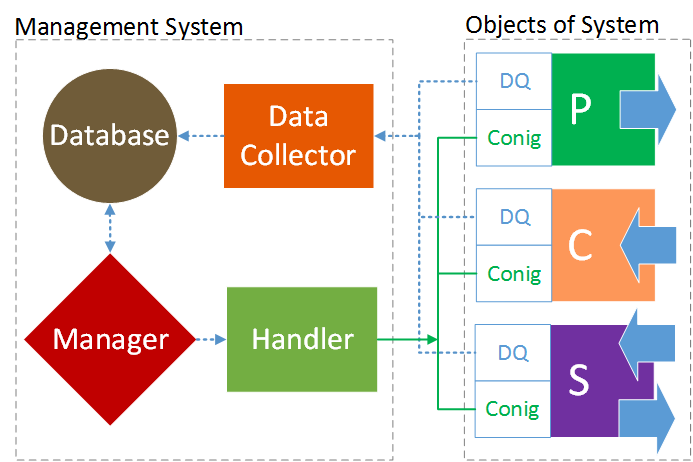

# SimulatedCPSLabVIEWEnergySystem

## Context of the development
In the context of the ηNet energy management project a system was developed that allows the energetic analysis and control of energy systems.The energy systems of the future will be a network of a multitude of technologies and applications. However, the diversity of these components, their topology and the size of the systems lead to a high degree of complexity. The energy systems of the future are confronted with serious problems for system stability and efficiency. The aim of the project is to develop a software and network system that abstracts and digitizes energy and information flows. This abstraction and digitization enables cross-system control.


## Concept of Energy Management System

For digitization, all field elements of the energy system are classified into three classes: producers, consumers and storages. Each real element is understood as a cyber-physical object (CPO) of these classes. This CPOs carry all values to fully describe and control the field elements of the energy system and serve as an interface for external applications. The real CPOs are generated by a single on-board computer. In this project VIs (Virtual Instruments) are used for this purpose. Due to the CPOs, the management system knows all about existingsystem components and the networking. This knowledge base is used for plant-specific optimization or adaptation algorithms. For example, to minimize costs or CO2 emissions. This enables higher control strategies and data managed systems. 



## Prerequisites
* To use the software, NI LabVIEW version 2017 or later is required. LabVIEW is a development environment and is for any measurement or control system. If you don't have a license for the development environment, you can use the evaluating version for now. [You can download it here](http://www.ni.com/de-de/shop/labview.html). 
* SQLite is used here for the database. The SQLite library can be integrated directly into corresponding applications so that no additional server software is required. Here the SQLite library for LabVIEW by Dr. James Powell was used. [Here you can download and install it](http://sine.ni.com/nips/cds/view/p/lang/de/nid/212894). 


## Deployment and Starting Demo Energy System
If so far everything is installed, then open a terminal and clone this repro:

```
cd ~
git clone https://github.com/IKKUengine/SimulatedCPSLabVIEWEnergySystem.git
cd SimulatedCPSLabVIEWEnergySystem
```

or download [it](https://github.com/IKKUengine/SimulatedCPSLabVIEWEnergySystem/archive/master.zip) to your home directory and open the folder. 

Look for a file with the extension .lvproj and double-click it. 
Only the two VIs are relevant for the start of the demo energy system:
* EnergyControlling.vi
* EnergyMonitoring.vi

Start first Virtual-TimeSimulated_EnergySystem.vi and then EnergyMonitoring.vi. 
The system is programmed so that the corresponding database and its structure is created automatically at startup. An insight into the database allows the EnergyMonitoring.vi. You can also use the [DB Browser for SQLite] (https://sqlitebrowser.org/).

## Controlling and Management
* Virtual-TimeSimulated_EnergySystem.vi


## Authors
Ferhat Aslan

## License

This project is licensed under MIT - see the [LICENSE](LICENSE) file for details


